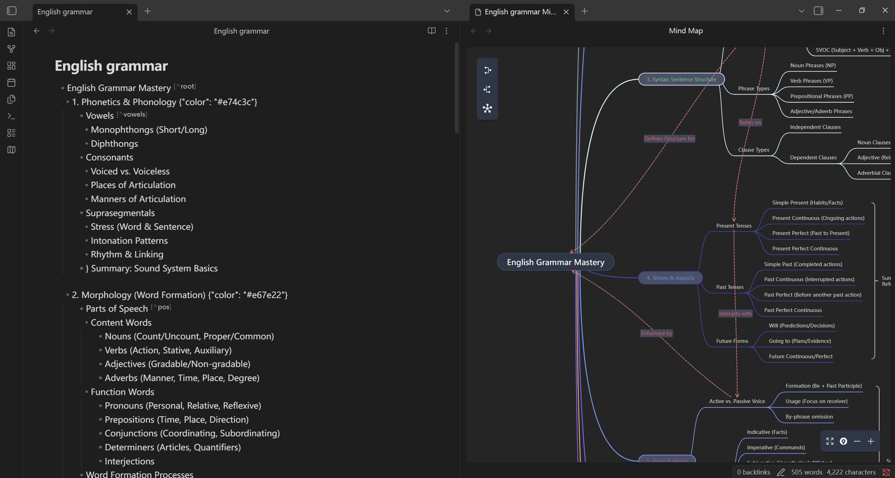
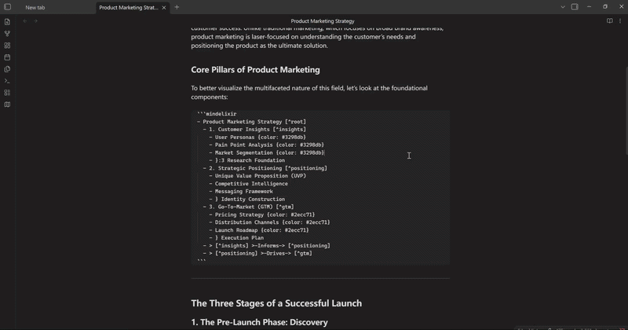

[English](README.md) | [中文](README_zh.md)

# Obsidian 思维导图

一个直观的 Obsidian 思维导图插件，使用 [Mind Elixir](https://github.com/ssshooter/mind-elixir-core) 将您的 Markdown 文档转换为交互式思维导图。

## 功能特性

### 思维导图视图



- **打开为思维导图**：将任意 Markdown 文件转换为交互式思维导图视图
- **智能解析**：自动将 Markdown 标题和列表解析为具有层级的思维导图节点
- **分屏视图**：在分屏中打开思维导图，同时保留原始文档
- **自动更新**：源文件内容发生变更时，思维导图会自动刷新
- **自定义根节点**：可选择使用文件名或第一个 H1 标题作为根节点

### 代码块渲染



- **内联思维导图**：使用 `mindelixir` 代码块在笔记中直接嵌入思维导图
- **纯文本格式**：使用简单的缩进文本格式快速创建思维导图
- **无缝集成**：思维导图在 Markdown 内容中自然渲染

### 移动端支持


- **支持移动端**：在 Obsidian 移动端应用上提供完整功能，让您随时随地查看并操作思维导图

## 使用方法

### 方法一：思维导图视图

1. 在 Obsidian 中打开任意 Markdown 文件
2. 点击左侧边栏（Ribbon）的思维导图图标，或者
3. 使用命令面板，输入并选择：`Mind Map: Open as Mind Map`
4. 您的 Markdown 内容将在分屏中作为交互式思维导图打开

### 方法二：代码块

使用 `mindelixir` 代码块创建内联思维导图：

````markdown
```mindelixir
Root Topic
  Subtopic 1
    Detail 1
    Detail 2
  Subtopic 2
    Detail 3
```
````

详细的格式规范，请参考 [Mind Elixir 纯文本格式规范](https://github.com/SSShooter/mind-elixir-core/blob/master/skills/plaintext-format/SKILL.md)。

## 设置

- **使用第一个 H1 作为根节点 (Use first H1 as root)**：启用后，将使用文件中的第一个 H1 标题而不是文件名作为根节点。第一个 H1 之前的内容将被忽略。

## 手动安装插件

- 将 `main.js`、`styles.css` 和 `manifest.json` 复制到您的 Vault 目录下的 `VaultFolder/.obsidian/plugins/your-plugin-id/` 中。

## 待办事项 (TODO)

- 支持节点的复制和粘贴
- 支持在 `mindelixir` 代码块中进行反向编辑
- 支持连线的记录与修改
- 导图内嵌图片支持
